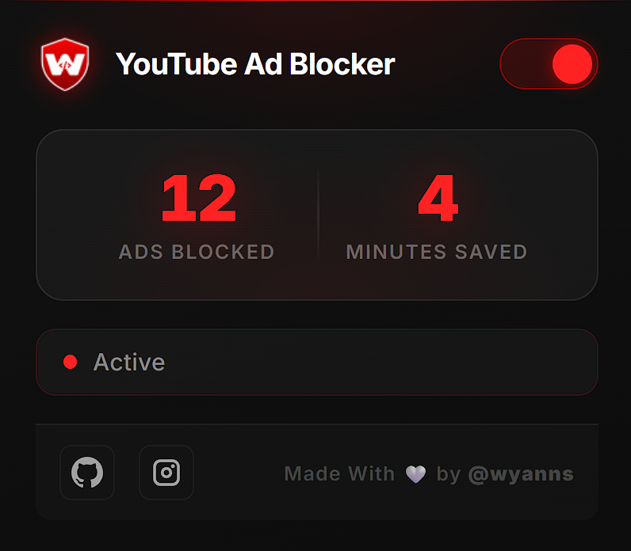

<p align="center">
    
</p>
<h1 align="center">
 YouTube Ad Blocker
</h1>

<p align="center">
  
  
</p>

<p align="center">
  
  
  
</p>

---

## 🎯 Overview

**YouTube Ad Blocker** is a simple Chrome Extension designed to provide a smooth, ad-free YouTube experience.

It works automatically to:

- detect ads
- skip video ads
- remove overlay and banner ads

No setup required. No manual interaction. Just install and enjoy.

---

## ✨ Features

- 🚫 **Auto Skip Ads** – instantly skips video ads
- 🧹 **Remove Overlay Ads** – eliminates banners and popups
- ⚡ **Lightweight** – no heavy dependencies
- 🔄 **Auto Injection** – works seamlessly on YouTube navigation
- 🔒 **Privacy Friendly** – no user data tracking

---

## 🚀 Installation

### 🔧 Manual Installation (Developer Mode)

1. Clone the repository:

```bash
git clone https://github.com/wyanns-404/youtube-ad-blocker.git
```

2. Open Chrome:

```
chrome://extensions/
```

3. Enable **Developer Mode**

4. Click **Load unpacked**

5. Select the project folder

---

## 🖼️ Preview



---

## ⚠️ Disclaimer

- This project is for **educational purposes only**
- YouTube continuously updates its system
- Ad-blocking effectiveness may change over time

---

## ⭐ Support

If you find this project useful:

👉 Give it a star
👉 Share it with others

---
